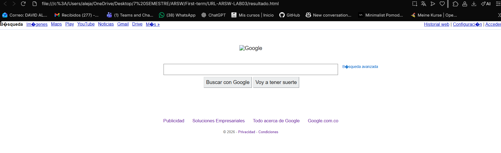

# URL-ARSW-LAB03

## Descripcion

Este proyecto es un ejercicio practico que demuestra el uso de la clase URL en Java para analizar y extraer los diferentes componentes de una direccion web.

## Funcionalidad del Codigo

El programa EjercicioURL1.java realiza las siguientes operaciones:

1. Crea un objeto URL utilizando la sintaxis moderna de Java mediante URI.create().toURL()
2. Extrae e imprime los siguientes componentes de la URL:
   - Protocolo: El esquema de comunicacion (https)
   - Autoridad: La combinacion de host y puerto
   - Host: El nombre del servidor (docs.oracle.com)
   - Puerto: El numero de puerto (-1 si no esta especificado)
   - Path: La ruta del recurso en el servidor
   - Query: Los parametros de consulta (null si no existen)
   - File: La combinacion de path y query
   - Referencia: El fragmento o ancla de la URL (null si no existe)

## Ejecucion

Para ejecutar el programa:

```bash
javac EjercicioURL1.java
java EjercicioURL1
```

## Nota Tecnica

El codigo incluye un comentario importante sobre la depreciacion del formato tradicional de creacion de URLs. La forma moderna recomendada es:

```java
URL nombre = URI.create("url").toURL();
```

En lugar del formato deprecado:

```java
URL nombre = new URL("url");
```

---

## EjercicioURL2

### Descripcion

Este programa permite al usuario ingresar una URL y descarga todo el contenido HTML de esa pagina web, guardandolo en un archivo local llamado "resultado.html".

### Funcionalidad del Codigo

El programa EjercicioURL2.java realiza las siguientes operaciones:

1. Solicita al usuario que ingrese una URL mediante la consola
2. Crea un objeto URL a partir de la entrada del usuario
3. Abre una conexion a la URL y lee su contenido linea por linea usando BufferedReader
4. Escribe cada linea leida en un archivo HTML local usando BufferedWriter
5. Maneja excepciones para URLs invalidas o problemas de conexion
6. Muestra un mensaje de confirmacion cuando el archivo se guarda exitosamente

### Ejemplos de Uso

**Input Valido:**
```
Ingrese la URL: 
https://www.example.com
```
Resultado: Crea el archivo "resultado.html" con el contenido HTML de la pagina.

**Input Invalido:**
```
Ingrese la URL: 
htp://pagina-que-no-existe.com
```
Resultado: Muestra el mensaje "La URL ingreasada no es valida" y termina el programa.

**Otros ejemplos de URLs validas:**
- https://www.google.com
- https://docs.oracle.com/javase/tutorial/
- http://info.cern.ch

### Archivo de Salida

El programa genera un archivo llamado "resultado.html" en el mismo directorio donde se ejecuta. Este archivo contiene todo el codigo HTML de la pagina web consultada.

### Archivo HTML generado visto en un navegador
